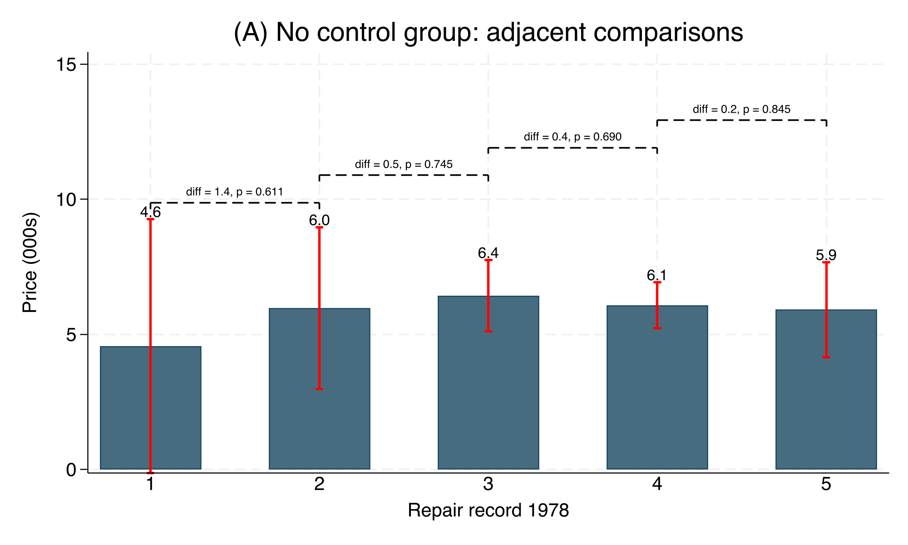
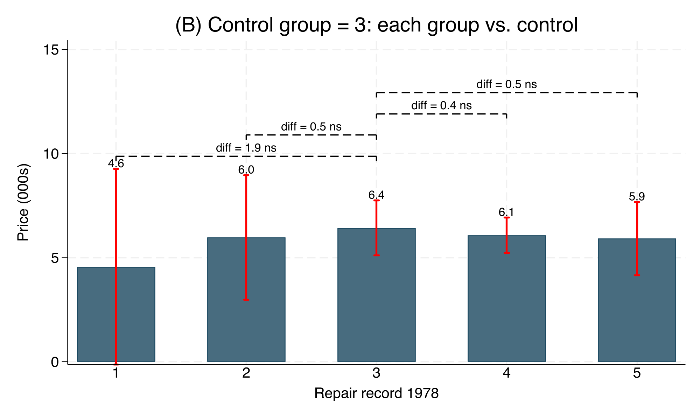

# barttest

A Stata command that draws a **bar chart of group means with confidence-interval
error bars and pairwise t-test brackets**. Significant differences are drawn with
a **solid** bracket, non-significant ones with a **dashed** bracket; each bracket
is labeled with the mean difference and the p-value (or significance stars).

**No control group** (adjacent comparisons) vs **with a control group** (every group vs. a reference):

| No control group | With control group |
|---|---|
|  |  |

## Requirements

- Stata 16 or newer

## Installation

### Option A — `net install` (recommended)

```stata
net install barttest, from("https://raw.githubusercontent.com/ganma0517/stata_barttest/main/") replace
```

### Option B — `github install`

Requires the community `github` command (`ssc install github` once), then:

```stata
github install ganma0517/stata_barttest
```

After installing, read the help and run the example:

```stata
help barttest
do barttest_example.do
```

## Quick start

```stata
sysuse auto, clear
barttest price, by(rep78)
```

## Examples: with vs. without a control group

```stata
sysuse auto, clear

* No control group — adjacent pairwise comparisons (default)
barttest price, by(rep78)

* No control group — pick specific pairs to compare
barttest price, by(rep78) compare("1/2 1/5 2/5")

* With a control group — every group compared to rep78==3
barttest price, by(rep78) base(3)

* With a control group + significance stars
barttest price, by(rep78) base(3) stars
```

A solid bracket = significant difference; dashed = non-significant. See
`barttest_example.do` and `barttest_example_control.do` for runnable scripts.

## Syntax

```
barttest depvar [if] [in], by(groupvar) [options]
```

| Option | Description | Default |
|---|---|---|
| `by(varname)` | grouping variable (required) | — |
| `level(#)` | CI level for error bars | 95 |
| `alpha(#)` | solid-vs-dashed significance threshold | 0.05 |
| `compare("a/b c/d")` | pairs to test, using group values | adjacent pairs |
| `base(#)` | reference group; compare all others to it | — |
| `stars` | label brackets with `* ** ***` / `ns` | off (shows p) |
| `barwidth(#)` | bar width | 0.6 |
| `barcolor()` `capcolor()` | bar / error-bar colors | navy / red |
| `decimals(#)` | decimals for means and diff | 1 |
| `title()` `ytitle()` `xtitle()` | titles | variable labels |
| `ylabel()` | full y-axis label spec | `, angle(0)` |
| `xlabel()` | extra x-axis label suboptions | — |
| `saving()` | export path (e.g. `fig.png`) | — |
| `name()` | graph window name | `barttest` |

See `help barttest` for full documentation and examples.

## Files

- `barttest.ado` — the command
- `barttest.sthlp` — Stata help file
- `barttest_example.do` — runnable examples (uses built-in `auto` data)
- `barttest_example_control.do` — with vs. without a control group
- `example_no_control.png`, `example_with_control.png` — demo figures
- `barttest.pkg`, `stata.toc` — package metadata for `net install`

## Citation

Lin, Wen-Cheng (2026). *barttest: Bar chart of group means with CI and pairwise
t-test brackets.* https://github.com/ganma0517/stata_barttest

## License

MIT — see [LICENSE](LICENSE).
